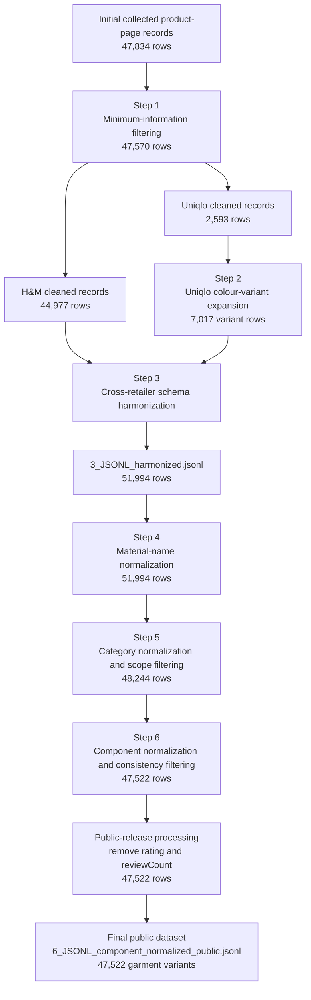

# A harmonized fast-fashion garment-variant dataset for textile circularity and sustainability assessment

[](https://doi.org/10.5281/zenodo.20006389)

This repository documents the workflow used to construct a harmonized garment-variant dataset from publicly accessible online product pages of H&M and Uniqlo in the United Kingdom and Australia. It contains the Python scripts, mapping tables, processing summaries, workflow figures, citation metadata, and license files needed to understand and reuse the dataset construction workflow.

The final public dataset is archived on Zenodo as:

```text
6_JSONL_component_normalized_public.jsonl
```

This file contains **47,522 colour-specific garment variants**. Each record provides harmonized product metadata, retailer region, source URL and timestamps, colour-specific variant information, retailer-disclosed material-composition text, normalized material text, harmonized garment categories, and parsed component-level material-composition records.

The GitHub repository does **not** track the final JSONL file directly because of file-size constraints. The complete archived release is available through Zenodo:

```text
https://doi.org/10.5281/zenodo.20006389
```

The release focuses on the processed research dataset and the workflow used to construct it. It does not redistribute product images, screenshots, raw HTML, full webpage captures, review text, product ratings, review counts, direct image URLs, or retailer-specific acquisition scripts.

## Contents

- [Dataset overview](#dataset-overview)
- [Repository and release structure](#repository-and-release-structure)
- [File inventory](#file-inventory)
- [Final public dataset](#final-public-dataset)
- [Key fields in the final public dataset](#key-fields-in-the-final-public-dataset)
- [Component-level structure](#component-level-structure)
- [Workflow overview](#workflow-overview)
- [Record flow across processing steps](#record-flow-across-processing-steps)
- [Processing steps](#processing-steps)
- [Public-release processing](#public-release-processing)
- [Relationship to the associated manuscript](#relationship-to-the-associated-manuscript)
- [Limitations](#limitations)
- [Ethics statement](#ethics-statement)
- [Recommended citation](#recommended-citation)
- [License](#license)
- [Third-party trademarks and source attribution](#third-party-trademarks-and-source-attribution)

## Dataset overview

The dataset covers product pages from two major fast-fashion retailers:

- H&M
- Uniqlo

The regional scope covers retailer websites in:

- United Kingdom
- Australia

H&M and Uniqlo were selected because their parent companies, H&M Group and Fast Retailing, rank among the largest global apparel manufacturers and retailers by annual sales after Inditex/Zara, while also providing structured online product information suitable for scalable garment-level analysis. The United Kingdom and Australia portals were selected to capture seasonal variation across Northern and Southern Hemisphere retail markets. This selection should be interpreted as a structured product-level dataset for two major fast-fashion retailers across two seasonally contrasting regional markets, not as a statistically representative sample of all fast fashion.

The dataset includes men’s, women’s, and children’s clothing. Product categories outside the intended clothing scope, such as footwear and accessories, were identified during category normalization and removed from the exported clothing dataset.

The analytical unit is the **colour-specific garment variant**, rather than the product-page record. This unit was used because colour, material composition, and product details may differ across variants of the same nominal product.

## Repository and release structure

The GitHub repository contains the maintained workflow documentation, Python scripts, mapping tables, processing summaries, workflow figures, citation metadata, and license files.

The Zenodo release contains the complete archived package, including the final public JSONL dataset and public-release summary:

```text
6_JSONL_component_normalized_public.jsonl
6_JSONL_component_normalized_public_summary.txt
```

Product URLs were collected between **24 and 26 March 2026**. Product-detail scraping was completed between **24 March and 8 April 2026**. The URL pool was fixed before detailed scraping so that product details were extracted from a predefined set of product URLs rather than from a continuously changing online catalogue.

All harmonized records retain two timestamps:

```text
url_collected_at
scraped_at
```

These timestamps allow users to distinguish the time when a product URL entered the dataset-construction workflow from the time when product details were extracted.

## File inventory

| File | Description |
|---|---|
| `README.md` | Main repository documentation for the dataset, processing workflow, released files, reuse potential, citation, and license information. |
| `6_JSONL_component_normalized_public.jsonl` | Final public garment-variant dataset. This file contains 47,522 colour-specific garment variants and is archived in the Zenodo release. |
| `6_JSONL_component_normalized_public_summary.txt` | Public-release summary documenting that `rating` and `reviewCount` were removed from all 47,522 records without changing the number of records. |
| `workflow_dataset_construction.png` | Static workflow schematic showing how product-page records were transformed into the final public dataset. |
| `workflow_dataset_construction.svg` | Editable/vector version of the workflow schematic. |
| `1_JSONL_drop_empty_summary.py` | Script for filtering product-page records with missing material or colour information and reporting retained/dropped records by brand and region. |
| `2_JSONL_uniqlo_variants_expansion.py` | Script for expanding Uniqlo product-page records into colour-specific garment-variant rows and assigning material-composition text to each variant. |
| `3_JSONL_key_harmonization.py` | Script for harmonizing cleaned H&M records and expanded Uniqlo records into a shared JSONL schema. |
| `4_JSONL_material_normalization.py` | Script for normalizing material names and adding `raw_material_text_norm` while preserving original material fields. |
| `5_JSONL_category_normalization.py` | Script for assigning normalized garment categories and filtering out accessories, footwear, and unallocated records. |
| `6_JSONL_component_normalization.py` | Script for parsing material-composition text into structured component-level composition records and applying component consistency checks. |
| `4_material_normalization_table.csv` | Exported material-name mapping table derived from the canonical material groups and multilingual aliases used in `4_JSONL_material_normalization.py`. |
| `5_category_mapping_table.csv` | Human-readable category mapping table linking rule order, parent categories, detail categories, include/exclude rule groups, and readable/raw patterns. |
| `5_category_regex_table.csv` | Technical regex inventory used for category assignment. |
| `6_component_name_summary_table.csv` | Summary table of normalized component names, component classes, and matched counts. |
| `6_component_rule_mapping_table.csv` | Full component-normalization rule mapping table containing regex patterns, readable rules, normalized component names, component classes, and matched counts. |
| `1_JSONL_drop_empty_summary.txt` | Processing summary for minimum-information filtering by brand and region. |
| `2_uniqlo_JSONL_uk_cleaned_variants_summary.txt` | Processing summary for Uniqlo UK colour-variant expansion. The same script was also run for Uniqlo Australia by changing the input file. |
| `3_JSONL_harmonized_summary.txt` | Processing summary for cross-retailer schema harmonization and harmonized line counts. |
| `4_JSONL_material_normalization_summary.txt` | Processing summary for material-name normalization, including row counts and number of changed normalized material-text records. |
| `5_JSONL_category_normalized_summary.txt` | Processing summary for category normalization, scope filtering, parent/detail category counts, and rule-source counts. |
| `6_JSONL_component_normalized_summary.txt` | Processing summary for component normalization, row filtering, component-class counts, component-name counts, and diagnostics. |
| `LICENSE.txt` | MIT license for source code and scripts. |
| `LICENSE-DATA.md` | CC BY 4.0 license statement for dataset files, derived tables, documentation, and metadata, unless otherwise stated. |
| `CITATION.cff` | Machine-readable citation metadata for GitHub and Zenodo citation support. |

## Final public dataset

The final public dataset is:

```text
6_JSONL_component_normalized_public.jsonl
```

Each line is one JSON object representing one colour-specific garment variant. The file contains:

```text
47,522 garment-variant records
```

The public file was generated after component normalization by removing the non-essential consumer-engagement fields:

```text
rating
reviewCount
```

No records were removed during this public-release processing step. The row count remained 47,522.

## Key fields in the final public dataset

| Field | Description |
|---|---|
| `parent_product_id` | Retailer product identifier for the parent product or product page. |
| `brand` | Retailer brand, either `hm` or `uniqlo`. |
| `region` | Retailer website region. |
| `url` | Product-page URL retained for provenance. |
| `url_collected_at` | Timestamp when the product URL was collected. |
| `scraped_at` | Timestamp when product details were scraped. |
| `gender_section` | Retailer gender or section label. |
| `raw_category` | Original retailer category information. For H&M this may contain breadcrumb-style category information; for Uniqlo it is generally broader. |
| `product_name` | Retailer product name. |
| `variant_colour` | Colour label of the garment variant. |
| `all_colour_labels` | All colour labels listed for the parent product. |
| `raw_material_text` | Material-composition text assigned to the colour-specific variant. |
| `raw_material_text_full` | Full material-composition text from the source record before variant-specific assignment. |
| `composition_assignment_type` | Method used to assign material-composition information to the colour-specific variant. |
| `raw_description_text` | Retailer-facing product description text retained where available. |
| `raw_function_text` | Retailer-facing function or attribute text retained where available. |
| `raw_material_text_norm` | Material-composition text after material-name normalization. |
| `detail_category` | Harmonized detailed garment category. |
| `detail_rule_source` | Field source used for category assignment, such as category tags, product name, or description text. |
| `detail_rule_hit` | Category rule that triggered the detail-category assignment. |
| `parent_category` | Harmonized parent garment category. |
| `components_structured` | Parsed and normalized component-level material-composition records. |

## Component-level structure

The field `components_structured` stores a list of parsed component records. Each component entry contains:

| Field | Description |
|---|---|
| `component_path_raw` | Raw component label from the material-composition string. |
| `component_name_norm` | Standardized component name assigned by the component-normalization rules. |
| `component_class` | Broader component class used for analysis and aggregation. |
| `component_norm_source` | Source of the component-normalization decision. |
| `materials` | List of material entries for the component. |
| `pct_sum` | Sum of reported material percentages for the component. |
| `pct_sum_flag` | Percentage-sum consistency flag. |
| `raw_text` | Component-level material-composition block. |

Each entry in `materials` contains:

| Field | Description |
|---|---|
| `material` | Normalized material name. |
| `pct` | Material percentage within the component. |
| `recycled_pct` | Reported recycled-content percentage where available; otherwise null. |

## Workflow overview

The dataset was produced through the following processing operations after product-page acquisition:

1. minimum-information filtering;
2. Uniqlo colour-variant expansion;
3. cross-retailer schema harmonization;
4. material-name normalization;
5. category normalization and scope filtering;
6. component normalization and consistency filtering;
7. public-release processing.

The scripts are numbered according to this workflow:

```text
1_JSONL_drop_empty_summary.py
2_JSONL_uniqlo_variants_expansion.py
3_JSONL_key_harmonization.py
4_JSONL_material_normalization.py
5_JSONL_category_normalization.py
6_JSONL_component_normalization.py
```

The following Mermaid diagram is provided for quick inspection in GitHub. The repository also includes static and editable figure files (`workflow_dataset_construction.png` and `workflow_dataset_construction.svg`).



## Record flow across processing steps

| Step | Input records | Removed or unresolved records | Output records | Main purpose |
|---|---:|---:|---:|---|
| Initial collected product-page records | 47,834 | 264 removed | 47,570 | Remove records missing minimum material or colour information. |
| Uniqlo AU colour-variant expansion | 1,103 cleaned Uniqlo AU records | 7 unresolved expanded rows | 3,081 variant rows | Convert Uniqlo AU product-page records into colour-specific variants. |
| Uniqlo UK colour-variant expansion | 1,490 cleaned Uniqlo UK records | 16 unresolved expanded rows | 3,936 variant rows | Convert Uniqlo UK product-page records into colour-specific variants. |
| Cross-retailer schema harmonization | 44,977 H&M records + 7,017 Uniqlo variant records | 0 | 51,994 | Align H&M and Uniqlo records into a common schema. |
| Material-name normalization | 51,994 | 0 | 51,994 | Add normalized material labels while preserving original material text. |
| Category normalization and scope filtering | 51,994 | 3,750 removed | 48,244 | Assign harmonized garment categories and remove out-of-scope records. |
| Component normalization and consistency filtering | 48,244 | 722 removed | 47,522 | Parse component-level composition and remove inconsistent records. |
| Public-release processing | 47,522 | 0 records removed; `rating` and `reviewCount` removed from all records | 47,522 | Produce the final public JSONL dataset. |

## Processing steps

### Step 1: Minimum-information filtering

Product-page records were first filtered to retain only records with the minimum information required for downstream analysis.

For H&M records, the required fields were:

```text
material_sum
colour_label
```

For Uniqlo records, the required fields were:

```text
fabric_details_raw
colour_labels
```

Records were removed if they lacked material information, colour information, or both. The initial collected product-page data contained **47,834 records**. After removing records with missing material or colour information, **47,570 records** remained.

| Retailer-region | Original rows | Dropped rows | Rows after dropping |
|---|---:|---:|---:|
| H&M AU | 15,539 | 85 | 15,454 |
| H&M GB | 29,701 | 178 | 29,523 |
| Uniqlo AU | 1,104 | 1 | 1,103 |
| Uniqlo UK | 1,490 | 0 | 1,490 |
| **Total** | **47,834** | **264** | **47,570** |

Summary file:

```text
1_JSONL_drop_empty_summary.txt
```

### Step 2: Uniqlo colour-variant expansion

The analytical unit of the dataset is the colour-specific garment variant. H&M records were already treated as colour-specific variants because different colours were represented through distinct product-page URLs in the collected data. Uniqlo records required additional processing because one product page could contain multiple colour variants and, in some cases, variant-specific material composition.

The script `2_JSONL_uniqlo_variants_expansion.py` creates one row per Uniqlo colour variant. Where no internal material-composition branching was detected, the same composition text was assigned to all listed colours. Where product-ID-specific or colour-specific branching was present, the script isolated the relevant segment and assigned it to the corresponding colour. Records for which no reliable assignment could be established were removed rather than inferred.

| Region | Cleaned product-page records | Expanded rows before dropping unresolved cases | Dropped unresolved rows | Final variant rows |
|---|---:|---:|---:|---:|
| Uniqlo UK | 1,490 | 3,952 | 16 | 3,936 |
| Uniqlo AU | 1,103 | 3,088 | 7 | 3,081 |
| **Total** | **2,593** | **7,040** | **23** | **7,017** |

The field `composition_assignment_type` records how material composition was assigned to each colour-specific variant.

| Value | Meaning |
|---|---|
| `native_variant_hm` | H&M record was already treated as a colour-specific variant through the product-page URL. |
| `shared_no_variants` | No composition branching was detected; the same composition was assigned to all colour variants. |
| `mapped_by_colour_only` | Composition was assigned using colour labels in the source composition field. |
| `mapped_by_id_only` | Composition was assigned using product-ID-specific information. |
| `mapped_by_id_then_colour` | Product-ID-specific information was first isolated, then assigned by colour. |
| `mapped_by_other_colours_default` | A default “other colours” composition segment was assigned. |
| `unresolved_colour_mapping` | Colour-specific mapping could not be resolved; these rows were removed. |
| `unresolved_mapping` | General mapping could not be resolved; these rows were removed. |

Summary file:

```text
2_uniqlo_JSONL_uk_cleaned_variants_summary.txt
```

The same script was also run for Uniqlo Australia by changing the input file.

### Step 3: Cross-retailer schema harmonization

The script `3_JSONL_key_harmonization.py` harmonized cleaned H&M records and expanded Uniqlo records into one shared JSONL schema. Harmonization was necessary because H&M and Uniqlo used different field names, category structures, and formats for product names, material fields, colour labels, description fields, and function or attribute fields.

The harmonized output was:

```text
3_JSONL_harmonized.jsonl
```

The harmonized dataset contained **51,994 variant-level records**.

| Input file | Written rows |
|---|---:|
| `uniqlo_JSONL_uk_cleaned_variants.jsonl` | 3,936 |
| `uniqlo_JSONL_au_cleaned_variants.jsonl` | 3,081 |
| `hm_JSONL_au_cleaned.jsonl` | 15,454 |
| `hm_JSONL_gb_cleaned.jsonl` | 29,523 |
| **Total** | **51,994** |

Summary file:

```text
3_JSONL_harmonized_summary.txt
```

### Step 4: Material-name normalization

The script `4_JSONL_material_normalization.py` standardized material names by mapping different labels, abbreviations, branded terms, and multilingual aliases to common material names. Examples include mapping `polyamide`, `pa`, `pa6`, and `pa66` to `nylon`; mapping `pes`, `pet`, and `repreve` to `polyester`; and mapping `spandex` and `lycra` to `elastane`.

Input file:

```text
3_JSONL_harmonized.jsonl
```

Output file:

```text
4_JSONL_material_normalized.jsonl
```

The original fields were preserved unchanged:

```text
raw_material_text
raw_material_text_full
```

The normalized field added by this step was:

```text
raw_material_text_norm
```

The material-normalization step processed **51,994 records** and wrote **51,994 records**. In total, **9,392 records** had changed normalized material text after material-name normalization.

The complete material-name mapping is exported as:

```text
4_material_normalization_table.csv
```

This table is generated directly from the `CANON_GROUPS` and `MULTILINGUAL_ALIASES` dictionaries in `4_JSONL_material_normalization.py`.

Summary file:

```text
4_JSONL_material_normalization_summary.txt
```

### Step 5: Category normalization and scope filtering

The script `5_JSONL_category_normalization.py` assigned harmonized garment categories. The mapping combines retailer-native product taxonomies with sorting-oriented garment grouping logic. H&M breadcrumb categories provided a detailed retail taxonomy backbone, while Uniqlo product names were often more informative than Uniqlo’s broader category labels.

Input file:

```text
4_JSONL_material_normalized.jsonl
```

Output file:

```text
5_JSONL_category_normalized.jsonl
```

The resulting taxonomy has two levels:

```text
parent_category
detail_category
```

| Parent category | Detail categories |
|---|---|
| `tops` | `outerwear_coat`, `outerwear_jacket`, `outerwear_gilet`, `shirt_blouse`, `tshirt_polo`, `tank_camisole_vest`, `sweater_cardigan`, `sweatshirt_hoodie`, `top_generic` |
| `bottoms` | `jeans`, `trousers`, `leggings`, `joggers`, `shorts`, `skirts` |
| `underwear` | `underwear_bottoms`, `bras_lingerie`, `swimwear`, `socks_hosiery` |
| `overall` | `dresses`, `jumpsuits_overalls`, `sleepwear_homewear`, `set` |
| `footwear` | `footwear`, removed from the exported category-normalized clothing dataset |
| `accessories` | `accessories`, removed from the exported category-normalized clothing dataset |

Category normalization processed **51,994 records**. It removed **3,750** out-of-scope or unresolved records: **2,648** accessories, **1,087** footwear records, and **15** unallocated records. The output contained **48,244 clothing records**.

Parent-category counts after filtering were:

| Parent category | Count |
|---|---:|
| `tops` | 22,185 |
| `bottoms` | 12,172 |
| `overall` | 7,836 |
| `underwear` | 6,051 |

Documentation files:

```text
5_category_mapping_table.csv
5_category_regex_table.csv
5_JSONL_category_normalized_summary.txt
```

### Step 6: Component normalization and consistency filtering

The script `6_JSONL_component_normalization.py` parsed the normalized material-composition field into structured component-level records. Retailer-disclosed composition strings can describe different garment parts using heterogeneous component labels such as `shell`, `body`, `main`, `lining`, `pocket lining`, `collar`, `cuff`, `padding`, `coating`, and other component terms.

Input file:

```text
5_JSONL_category_normalized.jsonl
```

Component-normalized processing output:

```text
6_JSONL_component_normalized.jsonl
```

Final public output after public-release processing:

```text
6_JSONL_component_normalized_public.jsonl
```

The component-normalization script reads:

```text
raw_material_text_norm
```

and writes the structured component field:

```text
components_structured
```

The procedure extracts component-material blocks, material percentages, and recycled-content percentages where disclosed. It then assigns a normalized component name and broader component class.

During component normalization, **722 records** were removed: **4** records without usable material text and **718** records with component percentage sums above the consistency threshold. The component-normalized output contained **47,522 records**.

The final retained records include **68,427 component occurrences**.

| Component class | Count |
|---|---:|
| `surface_component` | 48,573 |
| `lining_component` | 9,621 |
| `pocket_component` | 4,786 |
| `trim_component` | 2,673 |
| `panel_component` | 1,348 |
| `filling_component` | 876 |
| `other_component` | 375 |
| `decoration_component` | 175 |

Documentation files:

```text
6_component_name_summary_table.csv
6_component_rule_mapping_table.csv
6_JSONL_component_normalized_summary.txt
```

## Public-release processing

The final public dataset was produced from the component-normalized processing output by removing two non-essential consumer-engagement fields:

```text
rating
reviewCount
```

These fields were removed from all **47,522 records**. No records were removed during this step, and the final public file still contains **47,522 colour-specific garment variants**.

Output file:

```text
6_JSONL_component_normalized_public.jsonl
```

Public-release summary:

```text
6_JSONL_component_normalized_public_summary.txt
```

The final public dataset retains source URLs, timestamps, product identifiers, product names, colour labels, material-composition fields, normalized material fields, normalized categories, and structured component records, while excluding product ratings and review counts.

## Relationship to the associated manuscript

The final public dataset is associated with the co-submitted Resources, Conservation and Recycling manuscript:

```text
Garment construction creates overlooked barriers to textile sorting and fibre-to-fibre recycling in fast fashion
```

The associated manuscript applies the dataset to analyse garment-construction features relevant to textile sorting, pre-processing, and fibre-to-fibre recycling. The dataset can also be reused independently for other textile circularity, material-composition, garment-category, and component-structure analyses.

## Limitations

This dataset is based on information disclosed on retailer product pages. It should not be interpreted as a physical garment teardown dataset. Some garment features may be absent if they were not disclosed by the retailer or could not be inferred from product-page information.

The normalized material, category, and component fields are rule-based analytical constructs. They are designed to make heterogeneous retailer information comparable across brands and regions, but they do not replace physical inspection.

The dataset represents a time-bounded online product collection defined by URL-collection and product-detail scraping timestamps. Product pages may have changed after the recorded scrape dates. The dataset should not be interpreted as a continuously updated catalogue of all products sold by each retailer.

The dataset supports reproducible assessment of potential sorting and preprocessing barriers, but it does not directly measure industrial sorting outcomes, preprocessing efficiency, or realized fibre-to-fibre recycling performance.

## Ethics statement

This dataset was derived from publicly accessible retailer product-page information. The work did not involve human subjects, animal experiments, social-media data, or user-generated review text. Product reviews, product images, screenshots, raw HTML, full webpage captures, product ratings, review counts, and retailer-specific acquisition scripts are not redistributed in the public release.

## Recommended citation

If you use this dataset or code, please cite the archived Zenodo release:

```text
Li, K., & Walther, G. (2026). A harmonized fast-fashion garment-variant dataset for textile circularity and sustainability assessment (1.0.0) [Data set]. Zenodo. https://doi.org/10.5281/zenodo.20006389
```

## License

Source code and scripts are licensed under the MIT License. See `LICENSE.txt`.

Dataset files, derived tables, documentation, and metadata are licensed under the Creative Commons Attribution 4.0 International License (CC BY 4.0), unless otherwise stated. See `LICENSE-DATA.md`.

The licenses apply only to the dataset files, derived tables, documentation, metadata, and code released by the authors. They do not grant rights to third-party trademarks, retailer website content, product images, webpage design, or other third-party intellectual property.

## Third-party trademarks and source attribution

H&M and Uniqlo are trademarks of their respective owners. H&M Group, Fast Retailing, H&M, and Uniqlo are not affiliated with, endorsed by, or sponsored by this repository or the associated dataset. Brand names are used only to identify the source websites from which publicly accessible product-page information was obtained.

