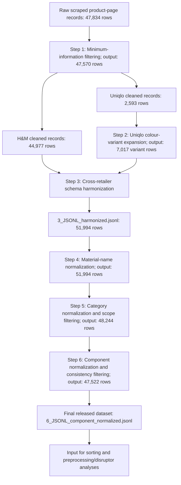

# Harmonized garment-variant dataset for textile sorting and fibre-to-fibre recycling analysis

This repository contains a curated garment-variant dataset and preprocessing pipeline derived from publicly accessible online product pages of H&M and Uniqlo in the United Kingdom and Australia.

The dataset was developed to support garment-level analysis of textile sorting compatibility, preprocessing requirements, and potential barriers to fibre-to-fibre recycling. It provides harmonized information on product identifiers, retailer region, colour-specific variants, material composition, normalized material names, normalized garment categories, normalized component structures, and derived analytical inputs.

The final dataset file is:

```text
6_JSONL_component_normalized.jsonl
```

This file contains **47,522 colour-specific garment variants** and is the direct input used for the associated textile sorting and preprocessing/disruptor analyses.

## Contents

- [Dataset overview](#dataset-overview)
- [Specifications](#specifications)
- [Schematic overview of dataset construction](#schematic-overview-of-dataset-construction)
- [Repository purpose](#repository-purpose)
- [Data source and accessibility](#data-source-and-accessibility)
- [Repository contents](#repository-contents)
- [File inventory](#file-inventory)
- [Final dataset](#final-dataset)
- [Key fields in the final dataset](#key-fields-in-the-final-dataset)
- [Component-level structure](#component-level-structure)
- [Value of the data and reuse potential](#value-of-the-data-and-reuse-potential)
- [Data-processing workflow](#data-processing-workflow)
- [Dataset-size summary](#dataset-size-summary)
- [Step 1: Minimum-information filtering](#step-1-minimum-information-filtering)
- [Step 2: Uniqlo colour-variant expansion](#step-2-uniqlo-colour-variant-expansion)
- [Step 3: Cross-retailer schema harmonization](#step-3-cross-retailer-schema-harmonization)
- [Step 4: Material-name normalization](#step-4-material-name-normalization)
- [Step 5: Category normalization and scope filtering](#step-5-category-normalization-and-scope-filtering)
- [Step 6: Component normalization and consistency filtering](#step-6-component-normalization-and-consistency-filtering)
- [Raw and processed data availability](#raw-and-processed-data-availability)
- [Relationship to sorting and preprocessing analyses](#relationship-to-sorting-and-preprocessing-analyses)
- [Public-release curation](#public-release-curation)
- [Limitations](#limitations)
- [Acknowledgements](#acknowledgements)
- [Ethics statement](#ethics-statement)
- [Recommended citation](#recommended-citation)
- [License](#license)

## Dataset overview

The data were collected from online product pages of two major fast-fashion retailers:

- H&M
- Uniqlo

The geographic scope covers retailer websites in:

- United Kingdom
- Australia

The dataset includes men’s, women’s, and children’s clothing. The analytical unit is the **colour-specific garment variant**, rather than the original product-page record.

This unit was chosen because colour, material composition, and product details can differ across variants of the same nominal product. These differences are relevant for sorting and recycling analysis, especially where colour, fibre composition, or component-level construction influences the interpretation of a garment.

## Specifications

| Item | Description |
|---|---|
| Subject area | Environmental science; industrial ecology; circular economy; textile recycling |
| Specific subject area | Garment-level retailer web data for textile sorting, preprocessing, and fibre-to-fibre recycling analysis |
| Type of data | Processed JSONL dataset; Python preprocessing scripts; CSV mapping and rule tables; TXT processing summaries |
| Data source | Publicly accessible H&M and Uniqlo product pages from the United Kingdom and Australia |
| Data collection period | URL collection: 24–26 March 2026; product-detail scraping: 24 March–8 April 2026 |
| Unit of analysis | Colour-specific garment variant |
| Final dataset | `6_JSONL_component_normalized.jsonl` |
| Number of final records | 47,522 garment variants |
| Repository contents | Final curated dataset, preprocessing scripts, processing summaries, normalization mapping tables, and documentation |
| Data accessibility | The archived version will be released through Zenodo with a persistent DOI |

## Schematic overview of dataset construction

The figure below summarizes how the final garment-variant dataset was generated from retailer product-page records through six steps.



This workflow shows how raw retailer product-page records were transformed into the final curated dataset `6_JSONL_component_normalized.jsonl`. The preprocessing pipeline first removes records lacking the minimum material-colour information needed for analysis, then expands Uniqlo records to colour-specific variants, harmonizes H&M and Uniqlo records into a common schema, normalizes material names, assigns a harmonized garment-category taxonomy, and finally parses and normalizes component-level composition information.

## Repository purpose

This repository documents how raw retailer product-page records were transformed into a harmonized, analysis-ready garment dataset.

The repository is intended to support:

- automated textile sorting research;
- textile preprocessing and feedstock-preparation analysis;
- garment-level fibre composition analysis;
- analysis of garment components, linings, trims, and secondary structures;
- fibre-to-fibre recycling-barrier assessment;
- reproducible use of retailer web data for textile circularity research.

The repository provides a curated research dataset. It is **not** a redistribution or mirror of retailer webpages.

## Data source and accessibility

The dataset was derived from publicly accessible online product pages of H&M and Uniqlo in the United Kingdom and Australia.

To reduce temporal inconsistency in the product pool, URL collection and product-detail scraping were separated. Product URLs were first collected within a concentrated time window for each retailer-region website, defining the product assortment before detailed product information was extracted. All harmonized records retain two timestamps:

```text
url_collected_at
scraped_at
```

URL collection occurred between **24 and 26 March 2026**, while product-detail scraping was completed between **24 March and 8 April 2026**. Although detailed scraping took place over a longer period, it was applied to a fixed URL pool, reducing the risk of mixing products from changing online assortments.

The archived release of this repository will be deposited on Zenodo.

```text
Repository: Zenodo
Data identification number: To be added
DOI: To be added
Direct URL: To be added
```

## Repository contents

This repository includes the following public-release files:

```text
6_JSONL_component_normalized.jsonl

1_JSONL_drop_empty_summary.py
2_JSONL_uniqlo_variants_expansion.py
3_JSONL_key_harmonization.py
4_JSONL_material_normalization.py
5_JSONL_category_normalization.py
6_JSONL_component_normalization.py

4_material_normalization_table.csv
5_category_mapping_table.csv
5_category_regex_table.csv
6_component_name_summary_table.csv
6_component_rule_mapping_table.csv

1_JSONL_drop_empty_summary.txt
2_uniqlo_JSONL_uk_cleaned_variants_summary.txt
3_JSONL_harmonized_summary.txt
4_JSONL_material_normalization_summary.txt
5_JSONL_category_normalized_summary.txt
6_JSONL_component_normalized_summary.txt
```

The public release contains the final curated dataset and the preprocessing documentation needed to understand how it was constructed. It does not redistribute product images, model images, screenshots, raw HTML, full webpage captures, review text, or unnecessary commercial webpage material.

## File inventory

| File | Description |
|---|---|
| `README.md` | Main documentation for the dataset, processing workflow, released files, and reuse potential |
| `6_JSONL_component_normalized.jsonl` | Final curated garment-variant dataset used as the direct input for the sorting and preprocessing/disruptor analyses |
| `1_JSONL_drop_empty_summary.py` | Script for filtering raw product-page records with missing material or colour information |
| `2_JSONL_uniqlo_variants_expansion.py` | Script for expanding Uniqlo product-page records into colour-specific variant rows |
| `3_JSONL_key_harmonization.py` | Script for harmonizing H&M and Uniqlo records into a common schema |
| `4_JSONL_material_normalization.py` | Script for material-name normalization |
| `5_JSONL_category_normalization.py` | Script for garment-category normalization and scope filtering |
| `6_JSONL_component_normalization.py` | Script for parsing and normalizing component-level material-composition information |
| `4_material_normalization_table.csv` | Material-name mapping table exported directly from `CANON_GROUPS` and `MULTILINGUAL_ALIASES` in the material-normalization script |
| `5_category_mapping_table.csv` | Human-readable category mapping table linking rule order, parent/detail categories, include/exclude rule groups, and readable/raw patterns |
| `5_category_regex_table.csv` | Technical category regex inventory containing include/exclude pattern groups |
| `6_component_name_summary_table.csv` | Summary table of normalized component names, component classes, and matched counts |
| `6_component_rule_mapping_table.csv` | Full component rule-mapping table containing regex patterns, readable rules, normalized component names, component classes, and matched counts |
| `1_JSONL_drop_empty_summary.txt` | Summary of minimum-information filtering by brand and region |
| `2_uniqlo_JSONL_uk_cleaned_variants_summary.txt` | Summary of Uniqlo UK colour-variant expansion. The same script was run separately for Uniqlo Australia by changing the input file |
| `3_JSONL_harmonized_summary.txt` | Summary of cross-retailer harmonization and final harmonized line counts |
| `4_JSONL_material_normalization_summary.txt` | Summary of material normalization, including row counts and number of changed normalized material-text records |
| `5_JSONL_category_normalized_summary.txt` | Summary of category normalization, scope filtering, parent/detail category counts, and rule-source counts |
| `6_JSONL_component_normalized_summary.txt` | Summary of component normalization, row filtering, component counts, and component-normalization diagnostics |

## Final dataset

The final processed dataset is:

```text
6_JSONL_component_normalized.jsonl
```

Each line is one JSON object representing one colour-specific garment variant.

The final dataset contains:

```text
47,522 garment-variant records
```

The final records include harmonized product metadata, normalized material text, normalized garment categories, and structured component-level composition information.

## Key fields in the final dataset

| Field | Description |
|---|---|
| `parent_product_id` | Retailer product identifier for the parent product or product page |
| `brand` | Retailer brand, either `hm` or `uniqlo` |
| `region` | Retailer website region |
| `url` | Product-page URL retained for provenance |
| `url_collected_at` | Timestamp when the product URL was collected |
| `scraped_at` | Timestamp when product details were scraped |
| `gender_section` | Retailer gender or section label |
| `raw_category` | Original retailer category information |
| `product_name` | Retailer product name |
| `variant_colour` | Colour label of the garment variant |
| `all_colour_labels` | All colour labels listed for the product |
| `raw_material_text` | Material-composition text assigned to the variant |
| `raw_material_text_full` | Full raw material-composition text from the source record |
| `composition_assignment_type` | Method used to assign material-composition information to the colour variant |
| `raw_description_text` | Retailer-facing product description text retained in the working schema where available |
| `raw_function_text` | Retailer-facing structured function or attribute text where available |
| `rating` | Retailer-disclosed product rating where available |
| `reviewCount` | Retailer-disclosed review count where available |
| `raw_material_text_norm` | Material-composition text after material-name normalization |
| `detail_category` | Harmonized detailed garment category |
| `detail_rule_source` | Field source used for category-rule assignment |
| `detail_rule_hit` | Category rule that triggered the detail-category assignment |
| `parent_category` | Harmonized parent garment category |
| `components_structured` | Parsed and normalized component-level material-composition records |

## Component-level structure

The field `components_structured` stores a list of parsed component records. Each component entry contains:

| Field | Description |
|---|---|
| `component_path_raw` | Raw component label from the material-composition string |
| `component_name_norm` | Standardized component name |
| `component_class` | Broader component class |
| `component_norm_source` | Source of the component-normalization decision |
| `materials` | List of material entries for the component |
| `pct_sum` | Sum of reported material percentages for the component |
| `pct_sum_flag` | Percentage-sum consistency flag |
| `raw_text` | Component-level material-composition block |

Each entry in `materials` contains:

| Field | Description |
|---|---|
| `material` | Normalized material name |
| `pct` | Material percentage within the component |
| `recycled_pct` | Reported recycled-content percentage where available; otherwise null |

## Value of the data and reuse potential

- The dataset provides garment-variant-level information on material composition, colour, product category, and component structure for two major fast-fashion retailers across two regional markets.

- The dataset can be reused to evaluate textile sorting compatibility, preprocessing requirements, and potential barriers to fibre-to-fibre recycling using transparent rule-based or alternative analytical frameworks.

- The normalized material, category, and component fields allow researchers to compare heterogeneous retailer-disclosed product information across brands, regions, garment types, and colour variants.

- The structured component-level representation can support further work on garment complexity, linings, trims, pocket structures, coatings, and other features relevant to textile circularity.

- The preprocessing scripts, CSV mapping tables, and TXT summary files provide an auditable workflow from retailer product-page records to an analysis-ready JSONL dataset.

- The dataset may also support future comparative work with other retailers, markets, or time periods, provided that new product-page data are transformed into a compatible schema.

## Data-processing workflow

The dataset was produced through six sequential preprocessing steps:

1. minimum-information filtering;
2. Uniqlo colour-variant expansion;
3. cross-retailer schema harmonization;
4. material-name normalization;
5. category normalization and scope filtering;
6. component normalization and consistency filtering.

The scripts are numbered according to this workflow:

```text
1_JSONL_drop_empty_summary.py
2_JSONL_uniqlo_variants_expansion.py
3_JSONL_key_harmonization.py
4_JSONL_material_normalization.py
5_JSONL_category_normalization.py
6_JSONL_component_normalization.py
```

## Dataset-size summary

| Step | Input records | Removed / unresolved records | Output records | Main purpose |
|---|---:|---:|---:|---|
| Raw scraped records | 47,834 | 264 removed | 47,570 | Remove records missing minimum material or colour information |
| Uniqlo AU colour-variant expansion | 1,103 cleaned Uniqlo AU records | 7 unresolved expanded rows | 3,081 variant rows | Convert Uniqlo AU records into colour-specific variants |
| Uniqlo UK colour-variant expansion | 1,490 cleaned Uniqlo UK records | 16 unresolved expanded rows | 3,936 variant rows | Convert Uniqlo UK records into colour-specific variants |
| Cross-retailer harmonization | 44,977 H&M records + 7,017 Uniqlo variant records | 0 | 51,994 | Align H&M and Uniqlo into a common schema |
| Material normalization | 51,994 | 0 | 51,994 | Add canonical material labels while preserving original material text |
| Category normalization and scope filtering | 51,994 | 3,750 removed | 48,244 | Assign harmonized garment categories and remove out-of-scope records |
| Component normalization and consistency filtering | 48,244 | 722 removed | 47,522 | Parse component-level composition and remove inconsistent records |
| Final analysis dataset | 47,522 | — | 47,522 | Direct input for sorting and preprocessing analyses |

## Step 1: Minimum-information filtering

Raw product-page records were first filtered to retain only records with the minimum information required for downstream rule evaluation.

For H&M records, the required fields were:

```text
material_sum
colour_label
```

For Uniqlo records, the required fields were:

```text
fabric_details_raw
colour_labels
```

Records were removed if they lacked material information, colour information, or both. This step was necessary because both material composition and colour are required for garment-level sorting and recycling-barrier assessment.

The raw scraped dataset contained **47,834 product-page records**. After removing records with missing material or colour information, **47,570 records** remained.

| Retailer-region | Original rows | Dropped rows | Rows after dropping |
|---|---:|---:|
| H&M AU | 15,539 | 85 | 15,454 |
| H&M GB | 29,701 | 178 | 29,523 |
| Uniqlo AU | 1,104 | 1 | 1,103 |
| Uniqlo UK | 1,490 | 0 | 1,490 |
| **Total** | **47,834** | **264** | **47,570** |

The summary file for this step is:

```text
1_JSONL_drop_empty_summary.txt
```

## Step 2: Uniqlo colour-variant expansion

The analytical unit of this dataset is the colour-specific garment variant.

H&M records were already treated as colour-specific variants because colour variants were represented through product-page URLs. Uniqlo records required additional processing because one Uniqlo product page could contain multiple colour variants and, in some cases, variant-specific material composition.

The Uniqlo expansion script creates one row per colour variant. Where no internal material-composition branching was detected, the same composition text was assigned to all listed colours. Where product-ID-specific or colour-specific branching was present in the raw material field, the script isolated the relevant segment and assigned it to the corresponding colour. Records for which no reliable assignment could be established were removed rather than inferred.

The script `2_JSONL_uniqlo_variants_expansion.py` is configured for one Uniqlo region at a time. It was run separately for the UK and Australia by changing the `input_file` variable.

### Uniqlo UK

| Metric | Count |
|---|---:|
| Cleaned product-page records | 1,490 |
| Expanded rows before dropping unresolved cases | 3,952 |
| Dropped unresolved rows | 16 |
| Final variant rows | 3,936 |

### Uniqlo Australia

| Metric | Count |
|---|---:|
| Cleaned product-page records | 1,103 |
| Expanded rows before dropping unresolved cases | 3,088 |
| Dropped unresolved rows | 7 |
| Final variant rows | 3,081 |

### Composition-assignment types

The field `composition_assignment_type` records how material composition was assigned to each colour-specific variant.

| Value | Meaning |
|---|---|
| `native_variant_hm` | H&M record was already treated as a colour-specific variant through the product-page URL |
| `shared_no_variants` | No composition branching was detected; the same composition was assigned to all colour variants |
| `mapped_by_colour_only` | Composition was assigned using colour labels in the raw composition field |
| `mapped_by_id_only` | Composition was assigned using product-ID-specific information |
| `mapped_by_id_then_colour` | Product-ID-specific information was first isolated, then assigned by colour |
| `mapped_by_other_colours_default` | A default “other colours” composition segment was assigned |
| `unresolved_colour_mapping` | Colour-specific mapping could not be resolved; these rows were removed |
| `unresolved_mapping` | General mapping could not be resolved; these rows were removed |

The summary file included in this repository for this step is:

```text
2_uniqlo_JSONL_uk_cleaned_variants_summary.txt
```

The Australia expansion counts are reported in the dataset-size summary and were generated by rerunning the same script with the Australia input file.

## Step 3: Cross-retailer schema harmonization

Cleaned H&M records and expanded Uniqlo records were harmonized into a common JSONL schema.

This step was needed because the two retailers used different raw field names, different category structures, and different formats for material, colour, description, and function information. Harmonization created a common schema that could be used by all subsequent normalization and rule-evaluation steps.

The harmonized output is:

```text
3_JSONL_harmonized.jsonl
```

The harmonized dataset contained **51,994 variant-level records**.

| Input file | Written rows |
|---|---:|
| `uniqlo_JSONL_uk_cleaned_variants.jsonl` | 3,936 |
| `uniqlo_JSONL_au_cleaned_variants.jsonl` | 3,081 |
| `hm_JSONL_au_cleaned.jsonl` | 15,454 |
| `hm_JSONL_gb_cleaned.jsonl` | 29,523 |
| **Total** | **51,994** |

The increase from 47,570 cleaned product records to 51,994 harmonized variant-level records occurs because Uniqlo product-page records were expanded into colour-specific garment variants.

The summary file for this step is:

```text
3_JSONL_harmonized_summary.txt
```

## Step 4: Material-name normalization

Material-name normalization was performed because retailer-disclosed composition strings can use different names, abbreviations, branded terms, or synonyms for analytically equivalent materials. For example, nylon and polyamide, elastane and spandex, and polyester and PES need to be treated consistently in downstream analysis.

The input file was:

```text
3_JSONL_harmonized.jsonl
```

The output file was:

```text
4_JSONL_material_normalized.jsonl
```

This step preserved the original material-composition fields and added a normalized material-text field:

```text
raw_material_text_norm
```

The original fields were retained unchanged:

```text
raw_material_text
raw_material_text_full
```

The material-normalization step processed **51,994 records** and wrote **51,994 records**. In total, **9,392 records** had changed normalized material text after material-name normalization.

The full material-name mapping used in this step is exported as:

```text
4_material_normalization_table.csv
```

This table is generated directly from the `CANON_GROUPS` and `MULTILINGUAL_ALIASES` dictionaries in `4_JSONL_material_normalization.py`, ensuring that the documentation matches the executed normalization logic.

The mapping table contains:

| Column | Description |
|---|---|
| `mapping_type` | Whether the row comes from the main canonical mapping or multilingual alias mapping |
| `canonical_material_name` | Normalized material name |
| `raw_labels_joined` | Raw labels mapped to the canonical material name |
| `n_raw_labels` | Number of raw labels in the mapping row |

The summary file for this step is:

```text
4_JSONL_material_normalization_summary.txt
```

## Step 5: Category normalization and scope filtering

Category normalization was performed because the scraped category information differed in structure and granularity between retailers. H&M product records contained relatively detailed breadcrumb-style category information, whereas Uniqlo records used broader category labels and often required product-name evidence to distinguish garment types.

Without harmonization, equivalent garments could remain separated under retailer-specific categories, making cross-brand aggregation and downstream sorting analysis inconsistent. The purpose of this step was therefore to translate heterogeneous retailer-facing categories into a common garment taxonomy that could be used for aggregation, comparison, and future reuse with other retailer datasets.

The taxonomy combines retailer-native product taxonomies with sorting-oriented grouping logic informed by the Sorting for Circularity Europe sorting handbook.

The input file was:

```text
4_JSONL_material_normalized.jsonl
```

The output file was:

```text
5_JSONL_category_normalized.jsonl
```

The resulting taxonomy has two levels:

```text
parent_category
detail_category
```

The parent category provides a broad garment group for aggregation, while the detail category provides a more specific garment type used for analysis and diagnostics.

The full parent-detail category mapping is:

| Parent category | Detail categories |
|---|---|
| `tops` | `outerwear_coat`, `outerwear_jacket`, `outerwear_gilet`, `shirt_blouse`, `tshirt_polo`, `tank_camisole_vest`, `sweater_cardigan`, `sweatshirt_hoodie`, `top_generic` |
| `bottoms` | `jeans`, `trousers`, `leggings`, `joggers`, `shorts`, `skirts` |
| `underwear` | `underwear_bottoms`, `bras_lingerie`, `swimwear`, `socks_hosiery` |
| `overall` | `dresses`, `jumpsuits_overalls`, `sleepwear_homewear`, `set` |
| `footwear` | `footwear` |
| `accessories` | `accessories` |

Records assigned to `footwear`, `accessories`, or no resolved category were treated as out of scope for the garment-level sorting and preprocessing analyses and were removed from the exported category-normalized dataset.

Out-of-scope records removed at this stage were:

| Removed category | Count |
|---|---:|
| Accessories | 2,648 |
| Footwear | 1,087 |
| Unallocated | 15 |
| **Total removed** | **3,750** |

After category normalization and scope filtering, **48,244 garment-variant records** remained.

### Final parent-category counts after category filtering

| Parent category | Count |
|---|---:|
| `tops` | 22,185 |
| `bottoms` | 12,172 |
| `overall` | 7,836 |
| `underwear` | 6,051 |

The category assignment was implemented as a deterministic rule-based procedure. For each record, the script assembled searchable fields from retailer category tags, product name, and product description. Field priority was adapted by retailer: H&M records prioritized detailed category breadcrumbs, while Uniqlo records prioritized product names. Scope filters for footwear and accessories were applied first, followed by increasingly specific garment-category rules. More specific categories were evaluated before broader fallback categories.

Two documentation tables are exported:

| File | Purpose |
|---|---|
| `5_category_mapping_table.csv` | Human-readable category mapping table linking each `detail_category` to its `parent_category`, rule group, source evidence, and rule order |
| `5_category_regex_table.csv` | Technical regex inventory containing include/exclude pattern groups in both readable and raw regex form |

The summary file for this step is:

```text
5_JSONL_category_normalized_summary.txt
```

## Step 6: Component normalization and consistency filtering

Component normalization was performed because retailer-disclosed material-composition strings often describe different garment parts using heterogeneous component labels. For example, the main visible fabric may appear as `shell`, `body`, `main`, `face`, or `outer layer`, while secondary structures may appear as `lining`, `pocket lining`, `collar`, `cuff`, `padding`, `coating`, or other local component labels.

This normalization was needed to make component-level information comparable across retailers and garment types. It also provides the structural basis for later sorting and preprocessing analyses, where the distinction between visible surface materials, concealed linings, trims, pockets, fillings, coatings, and secondary components is analytically important.

The input file was:

```text
5_JSONL_category_normalized.jsonl
```

The output file was:

```text
6_JSONL_component_normalized.jsonl
```

The component-normalization script reads the material-normalized field:

```text
raw_material_text_norm
```

It then parses the composition string into component-material blocks, extracts material percentages, preserves reported recycled-content information where available, assigns a normalized component name, and assigns a broader component class. The resulting component-level representation is stored in:

```text
components_structured
```

The component-normalization procedure uses deterministic first-match rules. The full rule-level mapping is exported as:

```text
6_component_rule_mapping_table.csv
```

A compact normalized component-name summary is exported as:

```text
6_component_name_summary_table.csv
```

### Component classes

The component taxonomy contains the following broad classes:

| Component class | Purpose in the dataset | Example normalized component names |
|---|---|---|
| `surface_component` | Main visible or surface textile layer used to identify the likely readable outer material | `main`, `shell`, `body`, `face`, `base_fabric`, `outer_layer`, `coating` |
| `lining_component` | Inner or concealed textile layers that may differ from the surface material | `lining`, `body_lining`, `sleeve_lining`, `hood_lining`, `inner_layer`, `cup_lining`, `interlining`, `petticoat` |
| `pocket_component` | Pocket-related components that may represent secondary material structures | `pocket`, `pocket_lining`, `pocket_fabric`, `chest_pocket_fabric`, `patch_pocket` |
| `trim_component` | Local garment trims or edge/detail structures | `collar`, `cuff`, `rib`, `lace`, `elastic_part`, `waist`, `belt`, `binding`, `tape`, `piping`, `strap` |
| `panel_component` | Named garment panels or local fabric sections | `front_panel`, `back_panel`, `side_panel`, `bottom_panel`, `top_panel`, `sleeve`, `hood`, `panel`, `woven_part`, `knit_part` |
| `filling_component` | Filling, padding, or insulation components | `filling`, `padding`, `body_filling`, `upper_body_filling`, `under_body_filling` |
| `decoration_component` | Decorative textile or surface-detail elements | `embroidery`, `frill`, `fringe`, `tulle`, `faux_fur`, `application`, `pattern_area`, `decorating_thread` |
| `other_component` | Reviewed residual component labels that did not fit the analytical classes above | `mesh`, `middle layer`, `other`, `other fabric`, `inner_support`, `details`, `storage_bag` |

### Component-normalization filtering

During component normalization:

| Filtering reason | Count |
|---|---:|
| No usable material text | 4 |
| Rows with component percentage sum above consistency threshold | 718 |
| **Total removed** | **722** |

After this step, the final dataset contained **47,522 records**.

### Component occurrence summary

The final dataset contains **68,427 component occurrences**.

| Component class | Count |
|---|---:|
| `surface_component` | 48,573 |
| `lining_component` | 9,621 |
| `pocket_component` | 4,786 |
| `trim_component` | 2,673 |
| `panel_component` | 1,348 |
| `filling_component` | 876 |
| `other_component` | 375 |
| `decoration_component` | 175 |

All retained component occurrences were matched by exact component-normalization rules.

The summary file for this step is:

```text
6_JSONL_component_normalized_summary.txt
```

## Raw and processed data availability

This repository releases the curated, analysis-ready dataset rather than the full raw scraped webpage records. The final released dataset is:

```text
6_JSONL_component_normalized.jsonl
```

This file is the direct input used for the associated sorting and preprocessing/disruptor analyses.

The public release also includes the preprocessing scripts, mapping tables, and processing summaries required to document how the final dataset was constructed from the raw scraped records. The full raw scraped files are not redistributed because they may contain unnecessary third-party webpage content, including long-form retailer descriptions, image-related metadata, review-related fields, or other commercial webpage material not required for reproducing the analytical dataset.

Product-page URLs and scrape timestamps are retained in the curated dataset to support provenance and allow users to trace the source records where pages remain available.

## Relationship to sorting and preprocessing analyses

The final file:

```text
6_JSONL_component_normalized.jsonl
```

is the shared empirical input for two related analyses.

The sorting-compatibility analysis uses normalized material, colour, category, and component fields to evaluate sorting-relevant barriers.

The preprocessing/disruptor analysis uses the same final dataset to identify garment features that may complicate preprocessing and fibre-to-fibre recycling, including hardware, trims, decorative or non-textile attachments, surface coatings or prints, linings, multilayer structures, and secondary components.

Study-specific rule outputs are generated from the final component-normalized dataset rather than from the raw scraped records.

## Public-release curation

This repository provides a curated research dataset rather than a full copy of retailer webpages.

The public release retains fields required for scientific reuse and reproducibility, including product-page URLs, scrape timestamps, product identifiers, product names, colour labels, material-composition fields, normalized materials, normalized categories, normalized components, quality-control flags, and analytical outputs.

The public release does not redistribute:

- product images;
- model images;
- screenshots;
- raw HTML;
- full webpage captures;
- direct image URLs;
- review text;
- unnecessary commercial metadata.

Retailer-facing description and function fields are retained only where they support reproducibility, category assignment, or downstream rule validation. Product images, raw HTML, review text, and full webpage captures are not redistributed.

## Limitations

This dataset is based on information disclosed on retailer product pages. It should not be interpreted as a physical teardown dataset.

Some garment features may be missing if they were not disclosed by the retailer or could not be inferred from product-page information.

The normalized material, category, and component fields are rule-based analytical constructs. They are designed to make heterogeneous retailer information comparable across brands and regions, but they do not replace physical inspection.

The dataset represents a fixed online product assortment defined by the URL-collection and product-detail scraping timestamps. Product pages may have changed after the recorded scrape dates.

The dataset supports reproducible assessment of potential sorting and preprocessing barriers, but it does not directly measure industrial sorting outcomes, preprocessing efficiency, or realized fibre-to-fibre recycling performance.

## Acknowledgements

This research was supported by the Werner Siemens Foundation through the WSS Research Centre Catalaix, a Project of the Century funded by the Werner Siemens Foundation.

The dataset was prepared by [Dr. Kai Li](https://www.om.rwth-aachen.de/gruppenleitung/kai-li/) at the Chair of Operations Management, RWTH Aachen University, with academic guidance from [Prof. Grit Walther](https://www.om.rwth-aachen.de/lehrstuhlleitung/prof-dr-grit-walther/?setlang=en).

## Ethics statement

This dataset was derived from publicly accessible retailer product-page information. The work did not involve human subjects, animal experiments, or data collected from social media platforms. Product reviews, user-generated content, product images, screenshots, raw HTML, and full webpage captures are not redistributed in the public release.

## Recommended citation

If you use this dataset or code, please cite the archived release:

```text
Li, Y., [co-authors]. (2026). Harmonized garment-variant dataset for textile sorting and fibre-to-fibre recycling analysis (Version 1.0.0) [Data set and code]. Zenodo. https://doi.org/xxxxx
```

Please replace the DOI above with the DOI assigned to the archived Zenodo release.

## License

Dataset files, derived tables, documentation, and metadata are licensed under the Creative Commons Attribution 4.0 International License (CC BY 4.0), unless otherwise stated.

Source code and scripts are licensed under the MIT License.

The dataset was derived from publicly accessible retailer product-page information. The public release does not redistribute product images, screenshots, raw HTML, review text, or full webpage captures. The above licenses apply only to the curated dataset, documentation, and code included in this repository.
